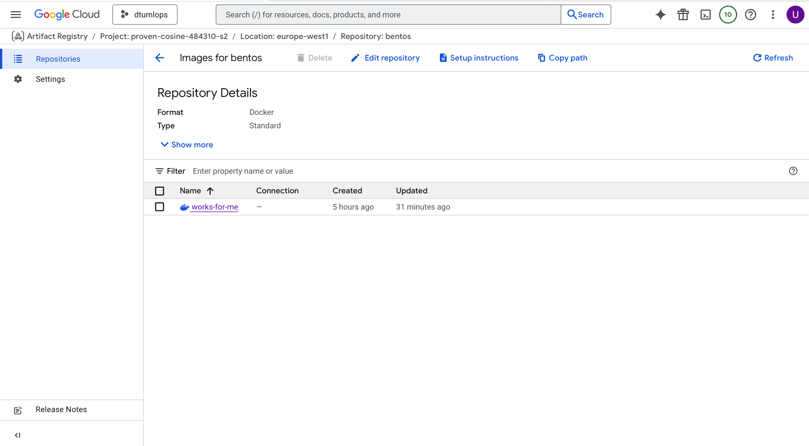
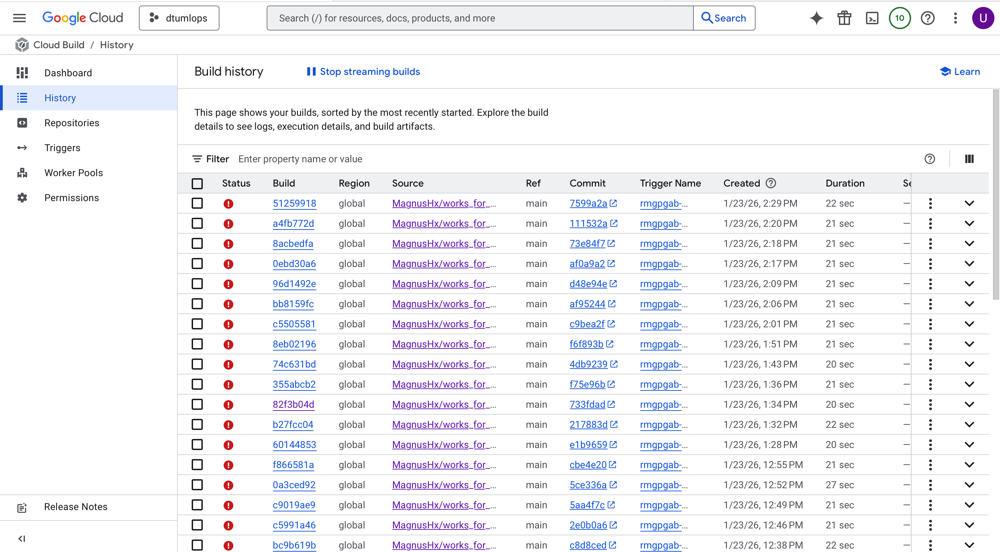

# Exam template for 02476 Machine Learning Operations

This is the report template for the exam. Please only remove the text formatted as with three dashes in front and behind
like:

```--- question 1 fill here ---```

Where you instead should add your answers. Any other changes may have unwanted consequences when your report is
auto-generated at the end of the course. For questions where you are asked to include images, start by adding the image
to the `figures` subfolder (please only use `.png`, `.jpg` or `.jpeg`) and then add the following code in your answer:

``

In addition to this markdown file, we also provide the `report.py` script that provides two utility functions:

Running:

```bash
python report.py html
```

Will generate a `.html` page of your report. After the deadline for answering this template, we will auto-scrape
everything in this `reports` folder and then use this utility to generate a `.html` page that will be your serve
as your final hand-in.

Running

```bash
python report.py check
```

Will check your answers in this template against the constraints listed for each question e.g. is your answer too
short, too long, or have you included an image when asked. For both functions to work you mustn't rename anything.
The script has two dependencies that can be installed with

```bash
pip install typer markdown
```

or

```bash
uv add typer markdown
```

## Overall project checklist

The checklist is *exhaustive* which means that it includes everything that you could do on the project included in the
curriculum in this course. Therefore, we do not expect at all that you have checked all boxes at the end of the project.
The parenthesis at the end indicates what module the bullet point is related to. Please be honest in your answers, we
will check the repositories and the code to verify your answers.

### Week 1

* [X] Create a git repository (M5)
* [X] Make sure that all team members have write access to the GitHub repository (M5)
* [X] Create a dedicated environment for you project to keep track of your packages (M2)
* [X] Create the initial file structure using cookiecutter with an appropriate template (M6)
* [X] Fill out the `data.py` file such that it downloads whatever data you need and preprocesses it (if necessary) (M6)
* [X] Add a model to `model.py` and a training procedure to `train.py` and get that running (M6)
* [X] Remember to either fill out the `requirements.txt`/`requirements_dev.txt` files or keeping your
    `pyproject.toml`/`uv.lock` up-to-date with whatever dependencies that you are using (M2+M6)
* [X] Remember to comply with good coding practices (`pep8`) while doing the project (M7)
* [X] Do a bit of code typing and remember to document essential parts of your code (M7)
* [ ] Setup version control for your data or part of your data (M8)
* [X] Add command line interfaces and project commands to your code where it makes sense (M9)
* [X] Construct one or multiple docker files for your code (M10)
* [X] Build the docker files locally and make sure they work as intended (M10)
* [X] Write one or multiple configurations files for your experiments (M11)
* [X] Used Hydra to load the configurations and manage your hyperparameters (M11)
* [X] Use profiling to optimize your code (M12)
* [ ] Use logging to log important events in your code (M14)
* [ ] Use Weights & Biases to log training progress and other important metrics/artifacts in your code (M14)
* [ ] Consider running a hyperparameter optimization sweep (M14)
* [ ] Use PyTorch-lightning (if applicable) to reduce the amount of boilerplate in your code (M15)

### Week 2

* [X] Write unit tests related to the data part of your code (M16)
* [X] Write unit tests related to model construction and or model training (M16)
* [X] Calculate the code coverage (M16)
* [X] Get some continuous integration running on the GitHub repository (M17)
* [X] Add caching and multi-os/python/pytorch testing to your continuous integration (M17)
* [X] Add a linting step to your continuous integration (M17)
* [X] Add pre-commit hooks to your version control setup (M18)
* [ ] Add a continues workflow that triggers when data changes (M19)
* [ ] Add a continues workflow that triggers when changes to the model registry is made (M19)
* [X] Create a data storage in GCP Bucket for your data and link this with your data version control setup (M21)
* [X] Create a trigger workflow for automatically building your docker images (M21)
* [X] Get your model training in GCP using either the Engine or Vertex AI (M21)
* [ ] Create a FastAPI application that can do inference using your model (M22)
* [X] Deploy your model in GCP using either Functions or Run as the backend (M23)
* [ ] Write API tests for your application and setup continues integration for these (M24)
* [ ] Load test your application (M24)
* [X] Create a more specialized ML-deployment API using either ONNX or BentoML, or both (M25)
* [ ] Create a frontend for your API (M26)

### Week 3

* [ ] Check how robust your model is towards data drifting (M27)
* [ ] Setup collection of input-output data from your deployed application (M27)
* [ ] Deploy to the cloud a drift detection API (M27)
* [ ] Instrument your API with a couple of system metrics (M28)
* [ ] Setup cloud monitoring of your instrumented application (M28)
* [ ] Create one or more alert systems in GCP to alert you if your app is not behaving correctly (M28)
* [ ] If applicable, optimize the performance of your data loading using distributed data loading (M29)
* [ ] If applicable, optimize the performance of your training pipeline by using distributed training (M30)
* [ ] Play around with quantization, compilation and pruning for you trained models to increase inference speed (M31)

### Extra

* [X] Write some documentation for your application (M32)
* [ ] Publish the documentation to GitHub Pages (M32)
* [X] Revisit your initial project description. Did the project turn out as you wanted?
* [X] Create an architectural diagram over your MLOps pipeline
* [X] Make sure all group members have an understanding about all parts of the project
* [X] Uploaded all your code to GitHub

## Group information

### Question 1
> **Enter the group number you signed up on <learn.inside.dtu.dk>**
>
> Answer:
>3

### Question 2
> **Enter the study number for each member in the group**
>
>
>
> Answer:
> *s245735, s235638, s24, s24*

### Question 3
> **Did you end up using any open-source frameworks/packages not covered in the course during your project? If so**
> **which did you use and how did they help you complete the project?**
>
> Recommended answer length: 0-200 words.
>
> Answer:
> Yes, we used a few open-source frameworks beyond what was covered in the course. Librosa was essential for audio handling and feature extraction (loading audio files, resampling, and creating spectrogram-based representations). We also used PyTorch for building and training the neural network model, since it gave us flexibility for experimenting with architectures and running training efficiently. For deployment, we relied on BentoML to wrap the model into a clean API with minimal boilerplate and to containerize it for cloud deployment.


## Coding environment

> In the following section we are interested in learning more about you local development environment. This includes
> how you managed dependencies, the structure of your code and how you managed code quality.

### Question 4

> **Explain how you managed dependencies in your project? Explain the process a new team member would have to go**
> **through to get an exact copy of your environment.**
>
> Recommended answer length: 100-200 words
>
> Example:
> *We used ... for managing our dependencies. The list of dependencies was auto-generated using ... . To get a*
> *complete copy of our development environment, one would have to run the following commands*
>
> Answer: We used the cookiecutter MLOPs template. This generated the pyproject.toml file. In this file we wrote all the dependencies, which serves like a single source truth for the runtime and development requirements. To get a complete copy of our environment, you should go to our github repository, copy the url, then in the terminal you can either clone or fork our repository. While we worked together on the project, we cloned the repo by using the git clone *url*.git and then u sync to get the packages needed to run our model. 

--- question 4 fill here ---

### Question 5

> **We expect that you initialized your project using the cookiecutter template. Explain the overall structure of your**
> **code. What did you fill out? Did you deviate from the template in some way?**
>
> Recommended answer length: 100-200 words
>
> Example:
> *From the cookiecutter template we have filled out the ... , ... and ... folder. We have removed the ... folder*
> *because we did not use any ... in our project. We have added an ... folder that contains ... for running our*
> *experiments.*
>
> Answer: We initialized our project by using the cookiecutter template, which layed the foundation for the structure of our repo. We did run into some issues, like the data/raw and data/preprocessed was not generated using the template. The template was mostly empty, or filled with another template. For example, the .py files in the src folder had a template for the code, so we used the template and filled in the rest of the code. I am not entirely sure on which exact files and folders were manually created by us, we simply used the cookiecutter template and started doing the project from there on out.  

--- question 5 fill here ---

### Question 6

> **Did you implement any rules for code quality and format? What about typing and documentation? Additionally,**
> **explain with your own words why these concepts matters in larger projects.**
>
> Recommended answer length: 100-200 words.
>
> Example:
> *We used ... for linting and ... for formatting. We also used ... for typing and ... for documentation. These*
> *concepts are important in larger projects because ... . For example, typing ...*
>
> Answer: We implemented some rules and tools to ensure code quality and consistency throughout our project. For linting and formatting, we used the Ruff tool, which detects potential issues and anomalies. Ruff was integrated into our workflow and pre-commit checks, ensuring that the code we commited met the standard we set before being merged into the main branch. We tried to maintan an understandable code by using clear function names and structure. We also had #notes to help understanding in some areas. These concepts matter in larger projects because it sets the foundation for how the project should be worked on. This eliminates potential issues, conflicts and confusion, which ensures project reliability among the team. Without any structure, things could fall apart quickly, and a lot of time would be wasted on debugging.  

--- question 6 fill here ---

## Version control

> In the following section we are interested in how version control was used in your project during development to
> corporate and increase the quality of your code.

### Question 7

> **How many tests did you implement and what are they testing in your code?**
>
> Recommended answer length: 50-100 words.
>
> Example:
> *In total we have implemented X tests. Primarily we are testing ... and ... as these the most critical parts of our*
> *application but also ... .*
>
> Answer: We have used tests, which can be found in the tests directory. We have 3 sets of tests, one for api, data and model. The test_data verifies that the AudioDataset class intializes correctly, that it imports from PyTorch's Dataset class, and that it loads the expected number of audio samples from the raw data folder. The test_model checks that the model is correctly initialized using the config.yaml file. These tests help catch errors early in our development process. We considered adding tests for the test_api, but as of now we have not finished it yet. 

--- question 7 fill here ---

### Question 8

> **What is the total code coverage (in percentage) of your code? If your code had a code coverage of 100% (or close**
> **to), would you still trust it to be error free? Explain you reasoning.**
>
> Recommended answer length: 100-200 words.
>
> Example:
> 
> Answer:
> *The total code coverage of code is 70%, which includes all our source code.*
> *If our code had 100% coverage would not mean that there would not be any errors as running code does in source does not mean all repo is working*

--- question 8 fill here ---

### Question 9

> **Did your workflow include using branches and pull requests? If yes, explain how. If not, explain how branches and**
> **pull request can help improve version control.**
>
> Recommended answer length: 100-200 words.
>
> Example:
> *We made use of both branches and PRs in our project. In our group, each member had an branch that they worked on in*
> *addition to the main branch. To merge code we ...*
>
> Answer: Yes, our workflow did include the use of branches and pull requests. We all git cloned the git repo. Each member then created a feature branch. We would work individually on our branch, and then push our work to the remote git repo. In the git repo we would then merge the commits from our branch to main via the pull requests. We had tests that would run before the final merge to ensure code quality (ruff) - As mentioned before. In addition to this, we would always git pull on our local main, git switch to our branch and then git rebase main branch. Only after this we would git add, commit and push. We did this to ensure we had the latest version of main before making changes, so we would have less conflicts. 

--- question 9 fill here ---

### Question 10

> **Did you use DVC for managing data in your project? If yes, then how did it improve your project to have version**
> **control of your data. If no, explain a case where it would be beneficial to have version control of your data.**
>
> Recommended answer length: 100-200 words.
>
> Example:
> *We did make use of DVC in the following way: ... . In the end it helped us in ... for controlling ... part of our*
> *pipeline*
>
> Answer:

--- question 10 fill here ---

### Question 11

> **Discuss you continuous integration setup. What kind of continuous integration are you running (unittesting,**
> **linting, etc.)? Do you test multiple operating systems, Python  version etc. Do you make use of caching? Feel free**
> **to insert a link to one of your GitHub actions workflow.**
>
> Recommended answer length: 200-300 words.
>
> Example:
> *We have organized our continuous integration into 3 separate files: one for doing ..., one for running ... testing*
> *and one for running ... . In particular for our ..., we used ... .An example of a triggered workflow can be seen*
> *here: <weblink>*
>
> Answer:
>
> Our continuous integration is implemented with GitHub Actions. In our repository we currently have the following workflows 
linting.yaml: runs our linting / style checks (code-quality gates) on pushes and pull requests.
tests.yaml: runs our unit test suite on pushes and pull requests to ensure changes don’t break existing functionality.
pre-commit-update.yaml: keeps our pre-commit hooks up to date (automation around maintaining consistent tooling versions).
We also have dependabot.yaml, which configures Dependabot to automatically open PRs for dependency updates.
Operating systems / Python versions: at the moment we do not run a test matrix across multiple operating systems or multiple Python versions—the CI runs on a single standard runner configuration.
Caching: we do not use caching (e.g., no pip/venv cache). Each workflow run installs dependencies from scratch, keeping the setup straightforward and reproducible.


--- question 11 fill here ---

## Running code and tracking experiments

> In the following section we are interested in learning more about the experimental setup for running your code and
> especially the reproducibility of your experiments.

### Question 12

> **How did you configure experiments? Did you make use of config files? Explain with coding examples of how you would**
> **run a experiment.**
>
> Recommended answer length: 50-100 words.
>
> Example:
> *We used a simple argparser, that worked in the following way: Python  my_script.py --lr 1e-3 --batch_size 25*
>
> Answer: We configured our experiements using a config.yaml file, which contains all of our hyperparameters and settings, such as the model architecture, learning rate, no. of epochs etc. This means no values are hardcoded in the code itself. Instead, the config.yaml values are accessed through the cfg, for example stride = int(cfg.model.stride). This makes the setup easy to run and repoducible. Since we used a secure shell in the cloud, we would run an experiement with the command: docker compose run audio-emotion-train. If changes were made to the config.yaml, we would have to push the changes and pull them down on the GCP SSH, and then run the experiment again. 

--- question 12 fill here ---

### Question 13

> **Reproducibility of experiments are important. Related to the last question, how did you secure that no information**
> **is lost when running experiments and that your experiments are reproducible?**
>
> Recommended answer length: 100-200 words.
>
> Example:
> *We made use of config files. Whenever an experiment is run the following happens: ... . To reproduce an experiment*
> *one would have to do ...*
>
> Answer: Reproducibility was important for our project. We ensured this by using the config.yaml file that contains all our hyperparameters and settings. This means no important information is lost between experimental runs, since all settings are stored in a safe version controlled file. In addition, we fixed a random seed defined in the config.yaml file. This help ensure that randomness, such as data shuffling and model initialization behave consistently through runs. To reproduce an experiment, one would clone the repo, uv sync the dependencies and run the training script using the same config.yaml file. As long as the config, code version and env. is the same, the experiment can be reproduced without the loss of information.

--- question 13 fill here ---

### Question 14

> **Upload 1 to 3 screenshots that show the experiments that you have done in W&B (or another experiment tracking**
> **service of your choice). This may include loss graphs, logged images, hyperparameter sweeps etc. You can take**
> **inspiration from [this figure](figures/wandb.png). Explain what metrics you are tracking and why they are**
> **important.**
>
> Recommended answer length: 200-300 words + 1 to 3 screenshots.
>
> Example:
> *As seen in the first image when have tracked ... and ... which both inform us about ... in our experiments.*
> *As seen in the second image we are also tracking ... and ...*
>
> Answer: 

--- question 14 fill here ---

### Question 15

> **Docker is an important tool for creating containerized applications. Explain how you used docker in your**
> **experiments/project? Include how you would run your docker images and include a link to one of your docker files.**
>
> Recommended answer length: 100-200 words.
>
> Example:
> *For our project we developed several images: one for training, inference and deployment. For example to run the*
> *training docker image: `docker run trainer:latest lr=1e-3 batch_size=64`. Link to docker file: <weblink>*
>
> Answer: We used Docker to containerize our project in order to make experiments and training more reproducible and easier to run across different computers. Docker was used when running the project through GCP, where we built and executed containers directly from the SSH terminal. We would build images using the docker compose build command and we would train our model using the docker compose run audio-emotion-train command.


--- question 15 fill here ---

### Question 16

> **When running into bugs while trying to run your experiments, how did you perform debugging? Additionally, did you**
> **try to profile your code or do you think it is already perfect?**
>
> Recommended answer length: 100-200 words.
>
> Example:
> *Debugging method was dependent on group member. Some just used ... and others used ... . We did a single profiling*
> *run of our main code at some point that showed ...*
>
> Answer:


--- question 16 fill here ---

## Working in the cloud

> In the following section we would like to know more about your experience when developing in the cloud.

### Question 17

> **List all the GCP services that you made use of in your project and shortly explain what each service does?**
>
> Recommended answer length: 50-200 words.
>
> Example:
> *We used the following two services: Engine and Bucket. Engine is used for... and Bucket is used for...*
>
> Answer: In our project we used several services from GCP to support our training end experimentation. Initially we created a GCP project. Within this project we enabled Compute Engine which we used to create a virtual machine instance. These instances were used to run our code remotely, including model training. We requested access to a GPU through Compute Engine. We tried with 2 and 1 GPU's, but were only accepted with 1. We also created a Cloud Storage Bucket, which we will be using to store data and files outside the virtual machine. Last but not least we accessed the virtual mahcine using the secure shell, which allowed us to work in the GCP environment through the GCP terminal. 

--- question 17 fill here ---

### Question 18

> **The backbone of GCP is the Compute engine. Explained how you made use of this service and what type of VMs**
> **you used?**
>
> Recommended answer length: 100-200 words.
>
> Example:
> *We used the compute engine to run our ... . We used instances with the following hardware: ... and we started the*
> *using a custom container: ...*
>
> Answer: We had to enable the compute engine in order to request access to a GPU and create and instance with the GPU. We used the instance with the following hardware: Machine type: n1-standard-8 (8 vCPUs, 30 GB Memory), GPU: 1 NVIDIA V100, Boot disk: 250GB. 

--- question 18 fill here ---

### Question 19

> **Insert 1-2 images of your GCP bucket, such that we can see what data you have stored in it.**
> **You can take inspiration from [this figure](figures/bucket.png).**
>
> Answer:


--- question 19 fill here ---

### Question 20

> **Upload 1-2 images of your GCP artifact registry, such that we can see the different docker images that you have**
> **stored. You can take inspiration from [this figure](figures/registry.png).**
>
> Answer: 


--- question 20 fill here ---

### Question 21

> **Upload 1-2 images of your GCP cloud build history, so we can see the history of the images that have been build in**
> **your project. You can take inspiration from [this figure](figures/build.png).**
>
> Answer: 



--- question 21 fill here ---

### Question 22

> **Did you manage to train your model in the cloud using either the Engine or Vertex AI? If yes, explain how you did**
> **it. If not, describe why.**
>
> Recommended answer length: 100-200 words.
>
> Example:
> *We managed to train our model in the cloud using the Engine. We did this by ... . The reason we choose the Engine*
> *was because ...*
>
> Answer: Yes, we managed to train our model in the cloud using GCP Compute Engine, rahter than Vertex AI. We chose Copmute Engine because it gave us more control over the environment, and because it was easier to integrate with our docker based workflow. We created an instance with GPU support enabled and accessed it using the SSH. From here, we cloned the git repo in the SSH and built our docker images directly on the virtual machine. Training was run inside a docker container ensuring the same dependencies and configs were sued as in our local setup. 

--- question 22 fill here ---

## Deployment

### Question 23

> **Did you manage to write an API for your model? If yes, explain how you did it and if you did anything special. If**
> **not, explain how you would do it.**
>
> Recommended answer length: 100-200 words.
>
> Example:
> *We did manage to write an API for our model. We used FastAPI to do this. We did this by ... . We also added ...*
> *to the API to make it more ...*
>
> Answer: 
Yes, we managed to write an API for our model using BentoML. We created a service.py that defines a BentoML @service and exposed prediction endpoints with @bentoml.api. The main endpoint takes either an uploaded file or (more conveniently for our setup) a GCS path to a .npy file, downloads it, loads it with numpy, and feeds it through the PyTorch model. A key detail was that our training saved a state_dict, not a full torch.nn.Module, so in the service we reconstruct the model architecture (Model(cfg)) and load the weights before switching to eval() mode. We also added a /healthz endpoint for readiness checks and a /metadata endpoint to expose model/config information, which makes debugging and monitoring easier.

--- question 23 fill here ---

### Question 24

> **Did you manage to deploy your API, either in locally or cloud? If not, describe why. If yes, describe how and**
> **preferably how you invoke your deployed service?**
>
> Recommended answer length: 100-200 words.
>
> Example:
> *For deployment we wrapped our model into application using ... . We first tried locally serving the model, which*
> *worked. Afterwards we deployed it in the cloud, using ... . To invoke the service an user would call*
> *`curl -X POST -F "file=@file.json"<weburl>`*
>
> Answer: 
Yes, we managed to write an API for our model using BentoML. We created a service.py that defines a BentoML @service and exposed prediction endpoints with @bentoml.api. The main endpoint takes either an uploaded file or (more conveniently for our setup) a GCS path to a .npy file, downloads it, loads it with numpy, and feeds it through the PyTorch model. A key detail was that our training saved a state_dict, not a full torch.nn.Module, so in the service we reconstruct the model architecture (Model(cfg)) and load the weights before switching to eval() mode. We also added a /healthz endpoint for readiness checks and a /metadata endpoint to expose model/config information, which makes debugging and monitoring easier.

```
curl -X POST "$SERVICE_URL/predict_gcs" \
  -H "Authorization: Bearer $(gcloud auth print-identity-token)" \
  -H "Content-Type: application/json" \
  -d '{"gcs_uri":"gs://audio_emotion_data_bucket/processed/Happy/03-01-03-01-01-01-01.npy","top_k":3}'
```
--- question 24 fill here ---

### Question 25

> **Did you perform any unit testing and load testing of your API? If yes, explain how you did it and what results for**
> **the load testing did you get. If not, explain how you would do it.**
>
> Recommended answer length: 100-200 words.
>
> Example:
> *For unit testing we used ... and for load testing we used ... . The results of the load testing showed that ...*
> *before the service crashed.*
>
> Answer:

--- question 25 fill here ---

### Question 26

> **Did you manage to implement monitoring of your deployed model? If yes, explain how it works. If not, explain how**
> **monitoring would help the longevity of your application.**
>
> Recommended answer length: 100-200 words.
>
> Example:
> *We did not manage to implement monitoring. We would like to have monitoring implemented such that over time we could*
> *measure ... and ... that would inform us about this ... behaviour of our application.*
>
> Answer:
> We didn’t manage to implement monitoring for our deployed model. If we had it, it would help a lot with keeping the application working well over a longer time. For example, we could track basic things like how long each request takes, how often the system fails, and if the server gets overloaded. This would make it easier to notice problems early instead of only finding out when users complain.
We could also monitor model-related things, like whether the inputs we get change over time (data drift) or if the model starts giving very different predictions than before. If that happens, it could mean the model performance is getting worse and we might need to retrain it or update the system. Overall, monitoring would help us understand what’s going on in production and make the application more stable and easier to maintain.

--- question 26 fill here ---

## Overall discussion of project

> In the following section we would like you to think about the general structure of your project.

### Question 27

> **How many credits did you end up using during the project and what service was most expensive? In general what do**
> **you think about working in the cloud?**
>
> Recommended answer length: 100-200 words.
>
> Example:
> *Group member 1 used ..., Group member 2 used ..., in total ... credits was spend during development. The service*
> *costing the most was ... due to ... . Working in the cloud was ...*
>
> Answer: During the project we used a shared GCP setup. One of our group memebers shared access to his instance to the rest of the group. As of now, we have used approximately 500kr. (Jan 22) This was covered by the intitial free trial credits provided by Google Cloud. The most expensive service was the Compute Engine when we used the GPU VM instance for training. We also forgot to off the instance 2 nights in a row, so we don't know how much credit we lost to our forgetfulness. 

--- question 27 fill here ---

### Question 28

> **Did you implement anything extra in your project that is not covered by other questions? Maybe you implemented**
> **a frontend for your API, use extra version control features, a drift detection service, a kubernetes cluster etc.**
> **If yes, explain what you did and why.**
>
> Recommended answer length: 0-200 words.
>
> Example:
> *We implemented a frontend for our API. We did this because we wanted to show the user ... . The frontend was*
> *implemented using ...*
>
> Answer:
>
> Unfortunately we could not implemet anything extra, because of the learning curve of the already given material.


--- question 28 fill here ---

### Question 29

> **Include a figure that describes the overall architecture of your system and what services that you make use of.**
> **You can take inspiration from [this figure](figures/overview.png). Additionally, in your own words, explain the**
> **overall steps in figure.**
>
> Recommended answer length: 200-400 words
>
> Example:
>
> *The starting point of the diagram is our local setup, where we integrated ... and ... and ... into our code.*
> *Whenever we commit code and push to GitHub, it auto triggers ... and ... . From there the diagram shows ...*
>
> Answer:

--- question 29 fill here ---

### Question 30

> **Discuss the overall struggles of the project. Where did you spend most time and what did you do to overcome these**
> **challenges?**
>
> Recommended answer length: 200-400 words.
>
> Example:
> *The biggest challenges in the project was using ... tool to do ... . The reason for this was ...*
>
> Answer: The overall project involved several challenges for us, most of which were related to the learning curve rather than the machine learning model itself. As third semester students in AI and Data, we have mainly been working with jupiter notebook, which is baby friendly. But this course required us to challenge ourselves into a more professional workflow, introducing terminal coding, GitHub collaboration, and Docker and GCP services. Learning how to work effectively with tools such as GitHub, Docker and GCP was both timeconsuming and challenging. A big amount of time was spent debugging issues and understanding the course material. We initially also struggled with understanding how all components fit together. To overcome these challenges, we worked hard together within the group, and tried our best to make sure everybody understood what was going on. No man left behind! We tried to break things into smaller parts to get a better understanding, and taking things one step at a time. 
We did also struggle with a bit of outdated course material - Mainly, the cloud setup took some time because the screenshots provided in the modules were outdated according to how the current GCP website is. Although we had some challenges, it has been extremely rewarding for all of us. The skills and knowledge we have gathered will for sure help us tremedously in the future of our study and work afterwards. Our challenges have been great for learning, and we all really appreciate this course.

--- question 30 fill here ---

### Question 31

> **State the individual contributions of each team member. This is required information from DTU, because we need to**
> **make sure all members contributed actively to the project. Additionally, state if/how you have used generative AI**
> **tools in your project.**
>
> Recommended answer length: 50-300 words.
>
> Example:
> *Student sXXXXXX was in charge of developing of setting up the initial cookie cutter project and developing of the*
> *docker containers for training our applications.*
> *Student sXXXXXX was in charge of training our models in the cloud and deploying them afterwards.*
> *All members contributed to code by...*
> *We have used ChatGPT to help debug our code. Additionally, we used GitHub Copilot to help write some of our code.*
> Answer: 

--- question 31 fill here ---
